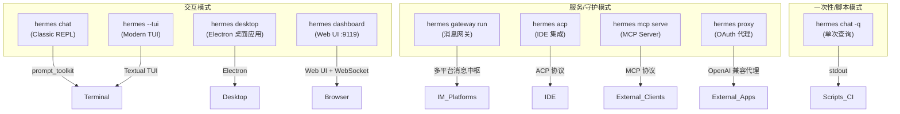

---

## Hermes 启动模式全景图

Hermes 共有 **9 种启动/运行模式**，覆盖从终端交互到生产部署的完整场景：



---

### 一、交互模式（4 种）

#### 1. Classic REPL — `hermes chat`

```bash
hermes                    # 默认就是 chat
hermes chat               # 显式指定
hermes --cli              # 强制 Classic REPL（覆盖 display.interface=tui）
```

- **界面**：基于 `prompt_toolkit` 的经典命令行 REPL
- **适用**：SSH 远程、低带宽、习惯传统 CLI 的用户
- **特点**：轻量、稳定、支持 `/` 斜杠命令、checkpoint 回滚

#### 2. Modern TUI — `hermes --tui`

```bash
hermes --tui              # 启动 Modern TUI
# 或持久化配置：
hermes config set display.interface tui
```

- **界面**：基于 Textual 框架的现代终端 UI
- **适用**：本地开发、追求更好视觉体验
- **特点**：分栏布局、更丰富的状态展示、`--dev` 支持 TypeScript 热重载

#### 3. Desktop App — `hermes desktop`

```bash
hermes desktop            # 启动 Electron 桌面应用
hermes desktop --source   # 开发模式，直接 electron .
```

- **界面**：Electron 打包的独立桌面应用
- **适用**：非终端用户、需要独立窗口体验
- **特点**：完整 GUI、支持 `--cwd` 指定项目目录

#### 4. Web Dashboard — `hermes dashboard`

```bash
hermes dashboard                        # 启动 Web UI (默认 :9119)
hermes dashboard --port 3000            # 自定义端口
hermes dashboard --insecure             # 允许非 localhost 绑定
hermes dashboard --status               # 查看运行状态
hermes dashboard --stop                 # 停止所有 dashboard 进程
```

- **界面**：Web UI + WebSocket (`/api/ws`)
- **适用**：浏览器访问、K8s 部署、远程管理
- **特点**：管理配置/API Keys/会话、支持多 Profile 切换、可与 Gateway 同容器运行（s6 伴随服务）

---

### 二、服务/守护模式（4 种）

#### 5. Gateway（消息网关）— `hermes gateway run`

```bash
hermes gateway run        # 前台运行
hermes gateway start      # systemd/launchd 后台服务
hermes gateway install    # 安装为系统服务
```

- **功能**：多平台消息中枢，同时承载：
  - **消息平台适配器**：Telegram / Discord / Slack / 飞书 / 企业微信 / WhatsApp / 微信 等 15+
  - **API Server** (`:8642`)：OpenAI 兼容 HTTP API
  - **Webhook Server** (`:8644`)：外部事件回调
  - **Cron 调度器**：定时任务
- **适用**：生产部署、多用户服务
- **特点**：单进程多端口，需 `replicas: 1`（PID 锁 + 内存状态）

#### 6. ACP（IDE 集成）— `hermes acp`

```bash
hermes acp                # 启动 ACP Server
hermes acp --setup        # 交互式配置 Provider/Model
```

- **协议**：Agent Communication Protocol
- **适用**：VS Code / Zed / JetBrains 等 IDE 集成
- **特点**：编辑器内嵌 AI 辅助编码

#### 7. MCP Server — `hermes mcp serve`

```bash
hermes mcp serve          # 作为 MCP Server 对外暴露
```

- **协议**：Model Context Protocol
- **适用**：让外部 MCP 客户端（Claude Desktop、Cursor 等）调用 Hermes 的工具能力
- **特点**：标准化协议，任何 MCP Client 都能对接

#### 8. OAuth Proxy — `hermes proxy`

```bash
hermes proxy start        # 启动本地 HTTP 代理
```

- **功能**：将 OAuth 认证的 Provider（如 Nous Portal）转换为 OpenAI 兼容的本地 HTTP 端点
- **适用**：让不支持 OAuth 的外部应用也能使用 Hermes 的模型
- **特点**：本地代理转发，任何 Bearer Token 都接受

---

### 三、一次性/脚本模式（1 种）

#### 9. 单次查询 — `hermes chat -q`

```bash
hermes chat -q "分析这个日志"                    # 单次查询
hermes chat -q "部署服务" -m "deepseek/deepseek-chat"  # 指定模型
hermes chat -q "..." --yolo                     # 跳过危险命令确认
hermes chat -q "..." --resume <session_id>      # 在已有会话中执行
```

- **适用**：Shell 脚本、CI/CD 流水线、Cron 定时任务
- **特点**：无交互、stdout 输出结果、可指定模型/工具集

---

### 四、模式对比总览

| 模式 | 命令 | 界面 | 端口 | 适用场景 | 持久运行 |
|------|------|------|------|---------|:---:|
| Classic REPL | `hermes` / `hermes chat` | 终端 (prompt_toolkit) | — | 日常开发、SSH | ❌ |
| Modern TUI | `hermes --tui` | 终端 (Textual) | — | 本地开发 | ❌ |
| Desktop | `hermes desktop` | Electron GUI | — | 桌面用户 | ❌ |
| Dashboard | `hermes dashboard` | Web UI | 9119 | 浏览器管理、K8s | ✅ |
| Gateway | `hermes gateway run` | 无界面（守护进程） | 8642/8644 | 生产消息服务 | ✅ |
| ACP | `hermes acp` | Stdio | — | IDE 集成 | ✅ |
| MCP Server | `hermes mcp serve` | Stdio | — | 对外暴露工具 | ✅ |
| OAuth Proxy | `hermes proxy start` | HTTP | 动态 | 代理认证 | ✅ |
| 单次查询 | `hermes chat -q "..."` | stdout | — | 脚本/CI/CD | ❌ |

---

### 五、K8s 部署中的组合模式

在你的 K8s 部署指南中，一个 Pod 同时运行了两种模式：

```
┌─────────────────────────────────────────┐
│  Hermes Pod                             │
│                                         │
│  s6-svscan (PID 1)                      │
│  ├── hermes dashboard :9119  (伴随服务)  │
│  └── hermes gateway run     (主进程)     │
│       ├── API Server :8642              │
│       ├── Webhook :8644                 │
│       └── Cron 调度器                    │
└─────────────────────────────────────────┘
```

通过 `HERMES_DASHBOARD=true` 环境变量，s6 进程管理器自动启动 Dashboard 作为伴随服务，与 Gateway 共享同一文件系统和 `state.db`。

---

### 六、选型建议

| 你的需求 | 推荐模式 |
|---------|---------|
| 本地写代码、调试 | `hermes` (Classic REPL) 或 `hermes --tui` |
| 非技术人员使用 | `hermes desktop` 或 `hermes dashboard` |
| 团队通过 IM 使用 | `hermes gateway run` |
| VS Code 内嵌 AI | `hermes acp` |
| 让其他 Agent 调用 Hermes | `hermes mcp serve` |
| CI/CD 流水线 | `hermes chat -q "..."` |
| 生产 K8s 部署 | `gateway run` + `dashboard` (s6 伴随) |
| 外部应用调模型 | `hermes proxy start` |
