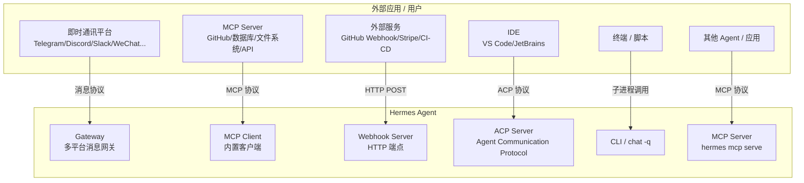

---

## 应用程序对接 Hermes 的方式 & 对外支持的协议

### 一、对接方式全景图



---

### 二、六大对接方式详解

#### 1. Gateway 消息平台（入站 — 用户 → Hermes）

Hermes Gateway 是一个多平台消息中枢，支持 **15+ 即时通讯平台**，用户通过这些平台直接与 Hermes 对话：

| 平台 | 协议/方式 | 适用场景 |
|------|----------|---------|
| Telegram / Discord / Slack / WhatsApp / Signal | 各平台 Bot API | 日常对话、移动端交互 |
| 企业微信 / 飞书 / 钉钉 | 企业 IM SDK | 企业内部协作 |
| Email / SMS | SMTP/IMAP / SMS 网关 | 异步通知、邮件触发 |
| Matrix / Mattermost | 开放联邦协议 | 自托管团队 |
| WeChat (微信) / iMessage (BlueBubbles) | 私有适配器 | 个人微信生态 |
| Home Assistant | HA 集成 | 智能家居语音控制 |
| **API Server** | HTTP REST | Open WebUI 等前端对接 |

**优点**：开箱即用，用户无需写代码，覆盖主流平台，同一 Agent 多平台同时在线。
**缺点**：依赖各平台 API 稳定性，部分平台有速率限制，需要 Hermes Gateway 进程持续运行。

---

#### 2. MCP Client（入站 — 外部工具 → Hermes）

Hermes 内置 **MCP (Model Context Protocol) 客户端**，启动时自动发现并注册外部 MCP Server 的工具，Agent 可以直接调用。

支持三种传输方式：

| 传输类型 | 配置方式 | 适用场景 |
|---------|---------|---------|
| **Stdio** | `command: "npx"` + `args` | 本地 MCP Server（GitHub、文件系统、数据库） |
| **HTTP / StreamableHTTP** | `url: "https://..."` | 远程 MCP 端点 |
| **OAuth HTTP** | `url` + `auth: oauth` | Linear、Sentry、Figma 等 SaaS |

配置示例：
```yaml
mcp_servers:
  github:
    command: "npx"
    args: ["-y", "@modelcontextprotocol/server-github"]
    env:
      GITHUB_PERSONAL_ACCESS_TOKEN: "ghp_xxx"
  remote_api:
    url: "https://mcp.example.com/mcp"
    headers:
      Authorization: "Bearer sk-xxx"
```

**优点**：生态丰富（社区有大量现成 MCP Server），自动工具发现，无需写 Hermes 原生工具代码，支持工具白名单过滤。
**缺点**：需要额外安装 `mcp` Python 包 + Node.js/uv 运行时，Stdio 模式需管理子进程生命周期，OAuth 配置较复杂。

---

#### 3. MCP Server（出站 — Hermes → 外部应用）

Hermes 本身可以作为 **MCP Server** 对外暴露：

```bash
hermes mcp serve
```

外部 MCP 客户端（如 Claude Desktop、Cursor、其他 Agent）可以通过 MCP 协议调用 Hermes 的工具能力。

**优点**：标准化协议，任何支持 MCP 的应用都能对接。
**缺点**：相对较新的功能，生态仍在发展中。

---

#### 4. Webhook（入站 — 外部事件 → Hermes）

外部服务通过 HTTP POST 触发 Hermes Agent 执行任务：

```bash
hermes webhook subscribe github-issues \
  --events "issues" \
  --prompt "New issue #{issue.number}: {issue.title}" \
  --deliver telegram
```

**支持特性**：
- HMAC-SHA256 签名验证
- 负载模板（`{payload.field}` 语法）
- 多目标投递（Telegram / Discord / GitHub Comment 等）
- `--deliver-only` 模式：零 LLM 成本，纯消息转发

**优点**：事件驱动，零轮询，支持 GitHub / GitLab / Stripe / CI-CD 等主流服务，有签名安全机制。
**缺点**：需要 Hermes Gateway 持续运行，Webhook URL 需公网可达（本地开发需 ngrok/cloudflared 隧道）。

---

#### 5. ACP 协议（IDE 集成）

```bash
hermes acp
```

**ACP (Agent Communication Protocol)** 用于 IDE 集成，让 VS Code / JetBrains 等编辑器直接与 Hermes 通信。

**优点**：深度 IDE 集成，编码场景体验好。
**缺点**：仅限支持 ACP 的 IDE。

---

#### 6. CLI / 子进程调用（脚本集成）

```bash
# 一次性查询
hermes chat -q "分析这个日志文件" 

# 后台长时间任务
hermes chat -q "部署服务" &
```

**优点**：最简单，任何能执行 shell 的环境都能用，适合 CI/CD 流水线、定时任务。
**缺点**：每次调用启动新进程有开销，无状态（除非用 `--resume`），不适合高频交互。

---

### 三、协议总览

| 协议 | 方向 | 传输层 | 用途 |
|------|------|--------|------|
| **Messaging Platform APIs** (Telegram/Discord/Slack Bot API 等) | 入站 | HTTPS / WebSocket | 用户通过 IM 与 Hermes 对话 |
| **MCP (Model Context Protocol)** | 双向 | Stdio / HTTP / StreamableHTTP | 工具能力扩展，Hermes 既可作为 Client 也可作为 Server |
| **HTTP Webhook** | 入站 | HTTPS POST | 外部事件触发 Agent 执行 |
| **ACP (Agent Communication Protocol)** | 入站 | Stdio | IDE 集成 |
| **CLI 子进程** | 入站 | 进程调用 | 脚本 / CI-CD 集成 |
| **API Server** (Gateway 内置) | 入站 | HTTP REST | 前端应用对接（如 Open WebUI） |

---

### 四、选型建议

| 场景                  | 推荐方式                            |
| ------------------- | ------------------------------- |
| 团队成员日常使用            | Gateway（Telegram / 飞书 / 企业微信）   |
| 扩展 Hermes 工具能力      | MCP Client（接入 GitHub/数据库/API 等） |
| CI/CD 触发 Agent 任务   | Webhook                         |
| 让其他 Agent 调用 Hermes | MCP Server (`hermes mcp serve`) |
| IDE 内编码辅助           | ACP (`hermes acp`)              |
| Shell 脚本 / 定时任务     | CLI (`hermes chat -q`)          |
| 自建前端 / Open WebUI   | API Server                      |
